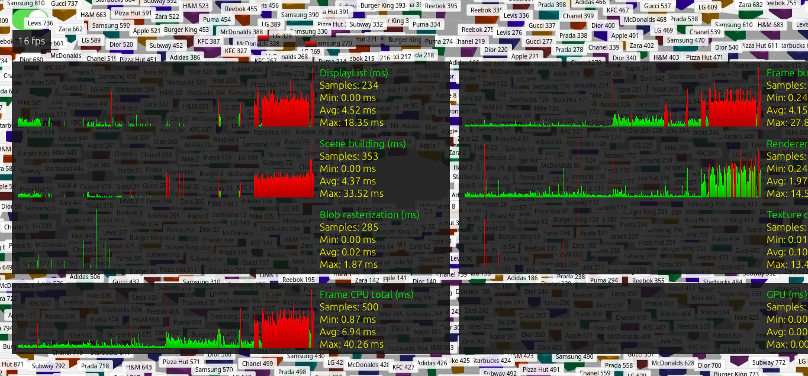
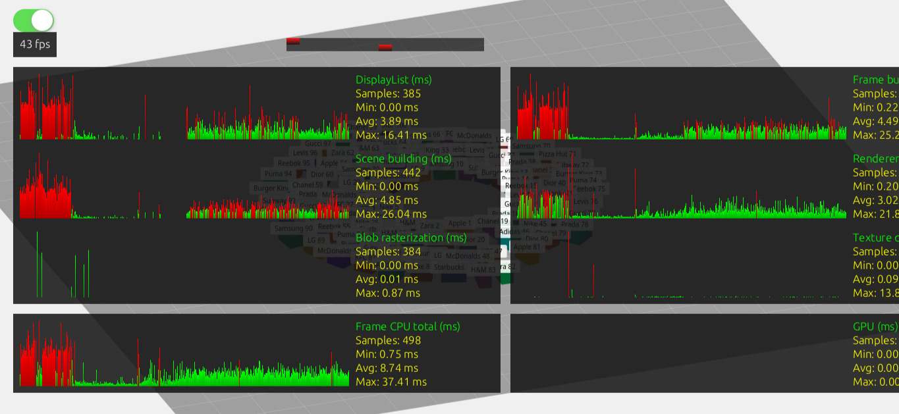

[DEMO](https://orionchar.github.io/rotunda/)

`git clone https://github.com/OrionChar/rotunda.git` -> `npm run dev`

### Пути оптимизации

Сейчас для отображения подписий используется CSS2DRenderer. При кратном увеличении количества объектов, такой подход не эффективен потому, что для каждого объекта создается отдельный DOM-элемент. Это приводит к значительным затратам на пересчет стилей: `< 20FPS` при 1000 объектов в сцене, против `> 40 FPS` при 100 объектов.

Способ оптимизации:

1. Исключать из процесса рендеринга подписи/объекты, находящиеся вне зоны видимости видимости камеры.

2. Объединяются в один атлас текстур все подписи, используя `CanvasTexture` вместо `CSS2DRenderer`.

3. Унифицировать геометрию и использовать `InstancedMesh`.

Если использовать `InstancedMesh`, то Raycaster не сможет вернуть конкретный Mesh, его луч пересекает общую геометрию. Однако при клике по геометрии, объекте пересечения содержит свойство instanceId, по этому идентификатору в специальном массиве находится исходный объект с его данными и координатами.

Можно использовать `Map` для поиска по ID: где ключом является уникальный идентификатор, а значением — объект, содержащий ссылку на меш, свойства магазина и индекс в инстансированной геометрии.

### Алгоритм размещения объектов

Логика размещения объектов основывается на принципе формирования концентрических колец вокруг центра координат. В начале процесса инициируется начальный радиус, равный 15 единицам, и начальный угол, равный нулю. 

Для каждого объекта рассчитывается угловая ширина, занимаемая им на текущей окружности. Данное значение вычисляется путем деления физической ширины объекта на текущий радиус. 

Перед размещением проверяется условие переполнения текущего кольца. Если сумма текущего угла, ширины объекта и углового отступа превышает полный круг (2π), выполняется переход на новую орбиту. При этом радиус увеличивается на величину максимальной глубины объектов в текущем кольце плюс дополнительный отступ, а текущий угол сбрасывается в ноль. 

Позиция объекта определяется в полярных координатах, которые затем преобразуются в декартовы координаты. Радиус размещения корректируется с учетом глубины объекта, чтобы его центр находился на соответствующем расстоянии от центра сцены. Высота устанавливается равной половине высоты объекта, что обеспечивает его размещение на плоскости XZ. 

После определения позиции объект ориентируется лицевой стороной к центру сцены посредством метода lookAt. Затем объект добавляется в сцену, а текущий угол увеличивается на ширину объекта и угловой отступ. Также отслеживается максимальная глубина в текущем кольце для корректного расчета расстояния до следующего ряда. 